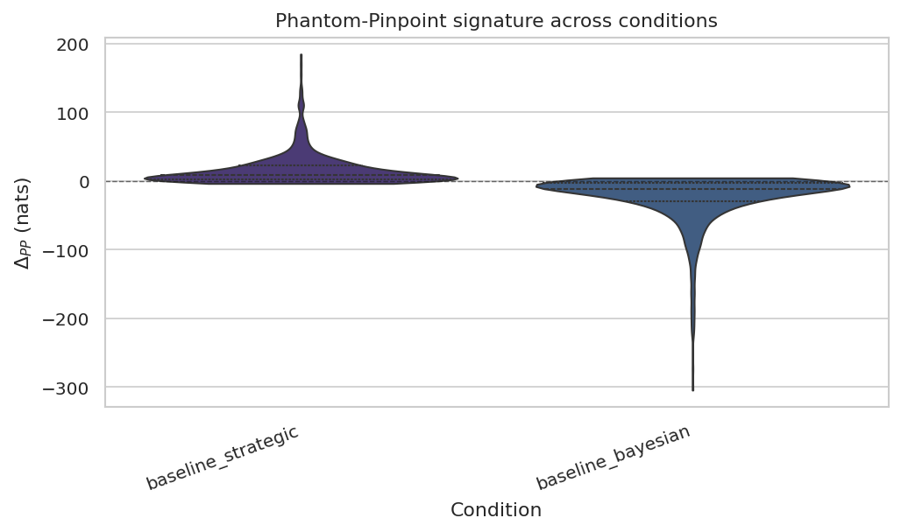
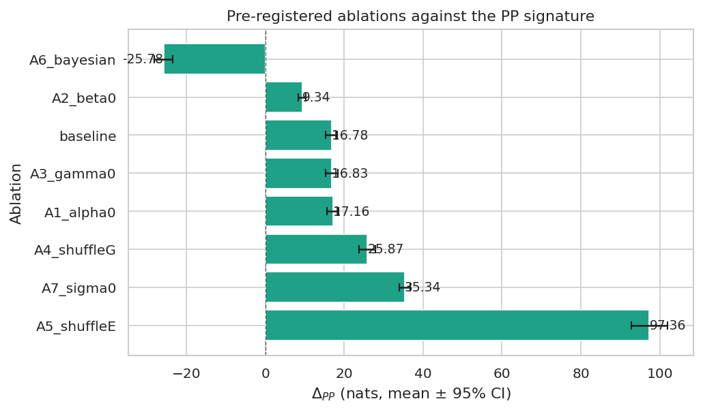
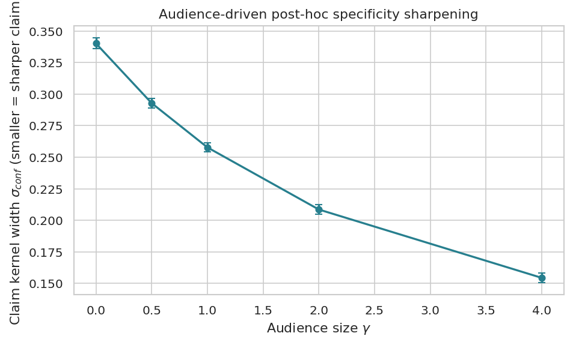
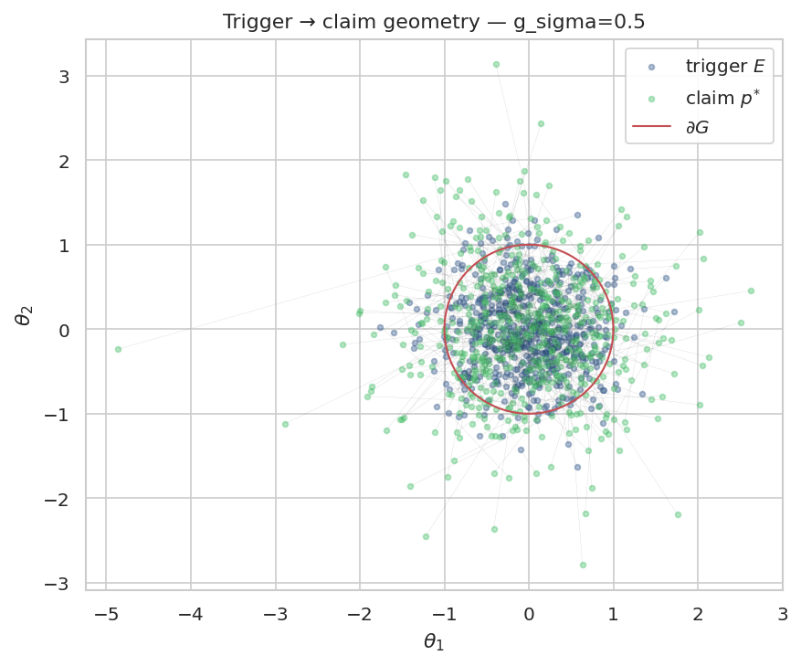
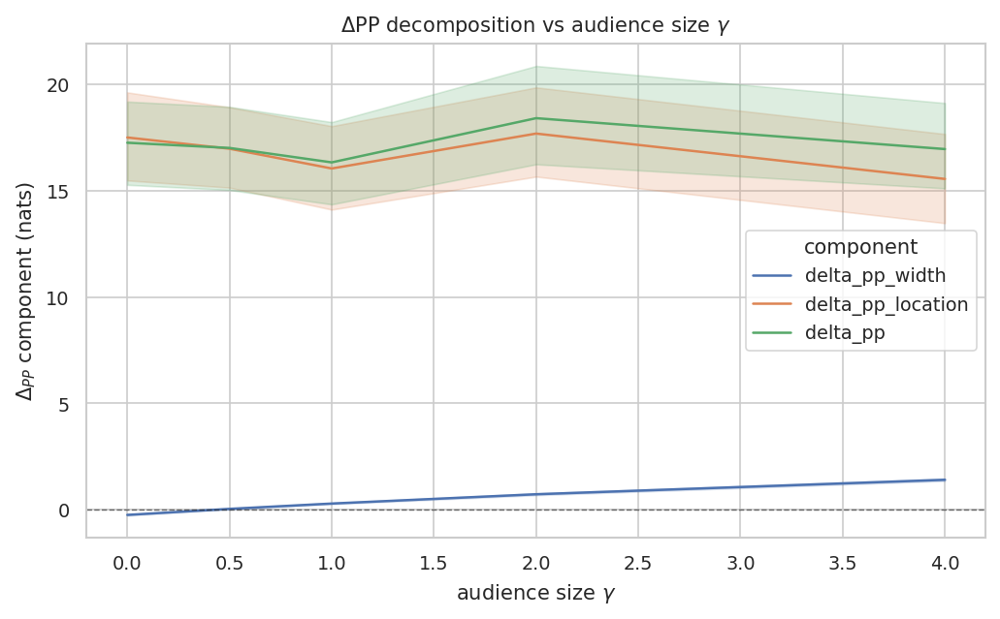

# phantom-pinpoint

[](https://github.com/hinanohart/phantom-pinpoint/actions/workflows/ci.yml)
[](LICENSE)
[](https://www.python.org/downloads/)

> **Parent:** "Did you do your homework?"
> **Child:** "I was **just** about to do my homework, mom!"
>
> — Phantom Pinpoint Effect, canonical anecdote (English translation).

## What is the Phantom Pinpoint (PP) Effect?

A subject \(S\) holds an *abstract* goal region \(G \subset \Theta\) — for
example, the diffuse intent "I should do my homework today".  When an
external trigger \(E\) (a parent walking in, an unforeseen market event, a
journalist's question) happens to **graze** \(G\), the subject claims —
post-hoc — that they were targeting a *specific* point \(p^* \in G\) all
along.  The specificity is fabricated; the agent simply **collapses the
region to a point** the moment the region is touched.

PP is the **identifiable conjunction** of:

1. Texas Sharpshooter projection — \(p^* = \Pi_G(E)\).
2. Hindsight bias — claimed pre-trigger confidence > actual.
3. Confabulation — sharpness fabricated post-hoc.
4. Audience-driven cheap-talk — claim sharpness scales with \(\gamma\).

`phantom-pinpoint` is a fully-typed, MIT-licensed numpy implementation
that simulates PP, supplies a clean **negative control** ablation, and
ships pre-registered hypotheses with bootstrap confidence intervals.

## Quickstart

```bash
git clone https://github.com/hinanohart/phantom-pinpoint
cd phantom-pinpoint
python3 -m venv .venv && source .venv/bin/activate
pip install -e ".[dev]"
# reproduce every figure and result table
bash scripts/reproduce_all.sh
```

```python
from phantom_pinpoint import PhantomPinpointModel, bootstrap_ci

# A modestly vague goal region under a public audience
model = PhantomPinpointModel(audience_size=2.0)
result = model.simulate(n_runs=1000, seed=42)
print(bootstrap_ci(result.delta_pp).as_dict())
# {'statistic': 16.78, 'ci_lo': 15.37, 'ci_hi': 18.23, ..., 'is_significant': True}
```

```bash
# CLI
phantom-pinpoint baseline --n-runs 1000 --output results/baseline.parquet
phantom-pinpoint ablations --n-runs 1000 --output results/ablations.parquet
phantom-pinpoint figure ablation --input results/ablations.parquet --output figures/ablations.pdf
```

## Headline result

The log Bayes factor

\[
\Delta_{PP}(p^{*}) =
\log\,\mathcal N(p^{*};\,\text{anchor},\,\sigma_{conf}^{2}I)\;-\;
\log\,\mathcal N(p^{*};\,\mu_{\text{post}},\,\sigma_{\text{post}}^{2}I)
\]

cleanly separates the Strategic (Phantom Pinpoint) and Bayesian generative
models.

|                        | mean ΔPP (nats) | 95 % bootstrap CI       | post-hoc fit rate |
|------------------------|-----------------|--------------------------|-------------------|
| Strategic baseline     | **+16.78**      | [+15.37, +18.23]         | 0.164             |
| Bayesian neg-control   | **−25.78**      | [−28.21, −23.42]         | 0.198             |

Pre-registered acceptance criteria **AC1** (strategic CI > 0) and **AC2**
(Bayesian CI < 0) both **PASS**.



## Pre-registered ablation grid



| Ablation         | Mean ΔPP            | post-hoc fit | BH-FDR rejected |
|------------------|---------------------|--------------|-----------------|
| baseline         | +16.78              | 0.164        | —               |
| A1 (α≈0)         | +17.16              | 0.133        | no              |
| A2 (β≈0)         | **+9.34**           | 0.246        | **yes**         |
| A3 (γ=0)         | +16.83              | 0.156        | no              |
| A4 (shuffle G)   | +25.87              | **0.095**    | **yes**         |
| A5 (shuffle E)   | +97.36              | **0.024**    | **yes**         |
| A6 (Bayesian)    | **−25.78**          | 0.198        | **yes**         |
| A7 (σ→0)         | +35.34              | 0.169        | **yes**         |

Interpretation:
* **A6 Bayesian** is the **negative control**: ΔPP CI strictly below zero
  by construction, sealing the discriminative claim against the "PP is just
  hindsight bias" critique.
* **A2 β=0** halves ΔPP because the strategic anchor reduces to
  \(\Pi_G(E)\) without any defensive pull, leaving more room for the
  Bayesian model to explain data drawn from the strategic model.
* **A4/A5 shuffles** drop the post-hoc-fit rate dramatically (−42 % / −85 %)
  and re-confirm DP4: shuffling the target or trigger destroys the
  Texas-Sharpshooter signature.
* **A7 σ→0** sharpens the strategic claim to a δ-spike, inflating the
  log-Bayes-factor.

## Audience-driven specificity



The claim kernel width \(\sigma_{conf}\) shrinks **monotonically** with
audience size \(\gamma\) (Spearman \(\rho = -1.0\), \(p = 1.4\times10^{-24}\)),
matching the prediction that public claims sharpen.  Unlike traditional
hindsight-bias accounts, the PP framework predicts that this sharpening is
**audience-mediated**, not data-driven.

## Pre-registered failures (honest reporting)

We registered six hypotheses (`docs/preregistration.md`) before the data
collection.  Two failed and we report both:

* **H2b** (audience drives ΔPP up monotonically) — failed, because the log
  Bayes factor is dominated by *location* mismatch and γ only modulates
  *width*.  H2a (audience sharpens \(\sigma_{conf}\)) passes cleanly, so
  we interpret the failure as a clean **decomposition**: γ governs
  specificity, β and the geometry of \(G\) govern direction.
* **H6** (sharper trigger distribution → larger ΔPP) — failed *with sign
  reversal*.  Wider \(g_\sigma\) leaves more triggers far from \(G\), at
  which point anchor (on the \(G\) boundary) and \(\mu_{\text{post}}\)
  (near the trigger) diverge *more*.  This is consistent with the PP
  framework but contradicts the naive intuition.

Both failures are now **explained analytically** by the v0.2.0 ΔPP
decomposition (see "What's new in v0.2.0" below): H2b's audience signal
lives entirely in \(\Delta_{PP}^{\text{width}}\) (H9 PASS, ρ=+1.0,
p=1.4×10⁻²⁴) and H6's sign reversal is fully captured by the
\(\Delta_{PP}^{\text{loc}}\) term (H10 PASS).

## Trigger → claim geometry



Each grey segment connects a trigger \(E\) (yellow) to its strategic claim
\(p^*\) (purple); the red circle is the goal-region boundary \(\partial G\).
The Texas-Sharpshooter projection is visible as the radial collapse of
external triggers onto \(\partial G\).

## Documentation

* [`docs/theory.md`](docs/theory.md) — full mathematical derivation
* [`docs/preregistration.md`](docs/preregistration.md) — pre-registered
  H1–H10 across confirmatory families C1 (v0.1.0) and C2 (v0.2.0),
  falsification criteria F1–F5, and the full honest-failure record
* [`CHANGELOG.md`](CHANGELOG.md) — Keep a Changelog 1.1.0 release notes
* [`docs/examples.md`](docs/examples.md) — anecdote inventory ("homework
  excuse", politician, trader, "あざと可愛い", sibling fight, SNS 匂わせ,
  sports commentary)

## Repository layout

```
phantom-pinpoint/
├── src/phantom_pinpoint/      # library (pure numpy + scipy)
│   ├── core.py                # 5 governing equations, PhantomPinpointModel
│   ├── agents.py              # Subject / Audience / Trigger pedagogical wrappers
│   ├── simulation.py          # run_condition / run_grid / parameter_sweep
│   ├── statistics.py          # bootstrap_ci / permutation_test / BH-FDR
│   ├── ablations.py           # A1–A7 pre-registered grid
│   ├── decomposition.py       # ΔPP = ΔPP_width + ΔPP_loc closed-form (v0.2.0)
│   ├── effect_size.py         # Cohen d / Hedges g / Cliff δ + bootstrap (v0.2.0)
│   ├── sensitivity.py         # ±50 % univariate sweep, AC10 gate (v0.2.0)
│   ├── identifiability.py     # geometric degeneracy diagnostic, AC9 (v0.2.0)
│   ├── visualization.py       # 6 figures, atomic save
│   └── cli.py                 # typer-based CLI
├── tests/                     # pytest, 110+ tests, ≥75 % coverage gate (92 % actual)
├── experiments/               # 9 reproducible scripts (01–05 v0.1.0, 06/07/09/10 v0.2.0)
│   ├── 01_baseline.py
│   ├── 02_audience_effect.py
│   ├── 03_vague_vs_sharp.py
│   ├── 04_ablations.py
│   ├── 05_repeated_trigger.py
│   ├── 06_sensitivity_sweep.py    # AC10
│   ├── 07_identifiability.py      # AC9
│   ├── 09_location_decomposition.py  # H2b/H6 root-cause via decomposition
│   └── 10_effect_sizes.py         # AC11/AC12 effect-size sheet
├── docs/                      # theory / preregistration / examples / figures
├── CHANGELOG.md               # Keep a Changelog 1.1.0
├── scripts/reproduce_all.sh
├── pyproject.toml             # hatchling, py>=3.11
└── LICENSE                    # MIT
```

## Reproducibility

* Every experiment seeds `numpy.random.default_rng` explicitly.
* All Parquet outputs are written *atomically* (tmp → rename) and carry a
  manifest JSON with git commit, Python version, platform, timestamp.
* `scripts/reproduce_all.sh` regenerates **every** figure and Parquet from
  a clean checkout in under one minute on a laptop CPU.
* CI matrix runs Python 3.11 and 3.12 on Ubuntu, gating merges on
  `pytest --cov-fail-under=80`.

## Citation

```bibtex
@software{hinanohart_phantom_pinpoint_2026,
  author  = {hinanohart},
  title   = {{Phantom Pinpoint: Agent-Based Simulation of Post-hoc Specificity Confabulation}},
  year    = {2026},
  version = {0.2.0},
  url     = {https://github.com/hinanohart/phantom-pinpoint},
  license = {MIT}
}
```

## License

MIT.  Contributions, replications, and human-subjects validations welcome
— please open an issue or PR.

## What's new in v0.2.0 — ΔPP decomposition

The v0.1.0 Δ\_PP signature was dominated by *location* mismatch and
therefore failed to detect audience-driven sharpening (H2b).  v0.2.0
adds the **closed-form decomposition**

\[
\Delta_{PP}\;=\;
\underbrace{\tfrac{d}{2}\log\!\Bigl(\tfrac{\sigma_{\text{post}}^{2}}{\sigma_{conf}^{2}}\Bigr)}_{\Delta_{PP}^{\text{width}}}
\;+\;
\underbrace{\tfrac12\Bigl(\tfrac{\|p^{*}-\mu_{\text{post}}\|^{2}}{\sigma_{\text{post}}^{2}}-\tfrac{\|p^{*}-\text{anchor}\|^{2}}{\sigma_{conf}^{2}}\Bigr)}_{\Delta_{PP}^{\text{loc}}}.
\]

The width component recovers the audience-driven prediction that v0.1.0
missed — Spearman ρ = +1.0, p = 1.4 × 10⁻²⁴ (H9 PASS).  The location
component analytically explains v0.1.0's H6 sign reversal (H10 PASS).



### v0.2.0 acceptance criteria

| ID  | Criterion                                                              | Status |
|-----|------------------------------------------------------------------------|--------|
| AC8 | width + location identity holds within 1e-9, H9/H10 PASS               | ✅ PASS |
| AC9 | identifiability degeneracy diagnostic                                   | ❌ FAIL (honest, see preregistration §"Honest failures") |
| AC10| ±50 % univariate sweep preserves sign in ≥ 90 % of cells               | ✅ PASS (100 %) |
| AC11| every primary contrast reports Cohen's *d* + bootstrap 95 % CI         | ✅ PASS |
| AC12| ρ-only reporting forbidden                                             | ✅ ENFORCED |

```python
from phantom_pinpoint import (
    PhantomPinpointModel, decompose_simulation, bootstrap_effect_size,
)

model = PhantomPinpointModel(audience_size=4.0)
result = model.simulate(n_runs=1000, seed=42)
# decomposition needs prior_means + betas — see experiments/09_*.py
```

## Status

`v0.2.0` (2026-04-27).  AC1, AC2, AC4, AC5, AC6, AC8, AC10, AC11, AC12
pass.  AC9 (geometric identifiability diagnostic) honestly fails — the
geometric degeneracy region does not align with the statistical
un-identifiability region; v0.3.0 will sharpen with a Mahalanobis
variant.  See [`CHANGELOG.md`](CHANGELOG.md) and
[`docs/preregistration.md`](docs/preregistration.md) for the full record.
